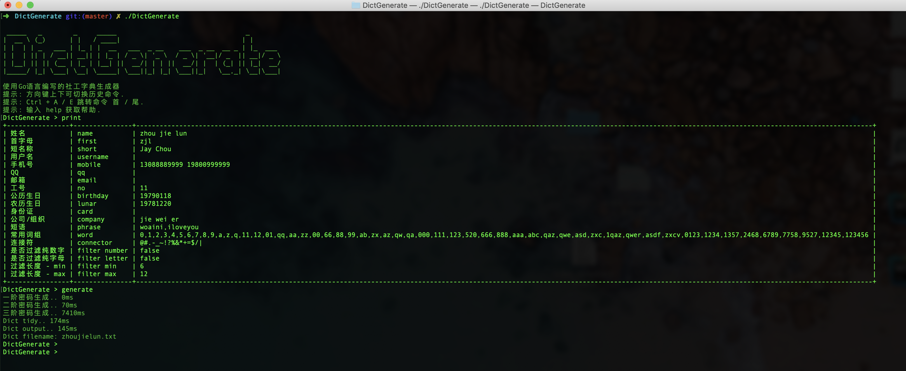

# DictGenerate 1.0.1 

使用Go语言编写的社工字典生成器

The social engineering dictionary generator written by Go

[](https://travis-ci.org/ziiber/DictGenerate)
[](https://github.com/ziiber/teler)
[](https://996.icu)
[-blue.svg)](https://github.com/996icu/996.ICU/blob/master/LICENSE)

## Build
```
git clone git@github.com:telanflow/DictGenerate.git
cd DictGenerate
go mod tidy
go build
```
Or
```
git clone git@github.com:telanflow/DictGenerate.git
cd DictGenerate
sh ./build.sh
```

## Download
[Download](https://github.com/telanflow/DictGenerate/releases)

## Usage
    USAGE:
       DictGenerate [global options] command [command options] [arguments...]
    
    COMMANDS:
         help, h  Shows a list of commands or help for one command
       其他:
         print, p    打印
         reset       重置
         clear, cls  清空控制台
       生成:
         generate, run  生成字典
         filter         过滤器
         set            设置属性
             name       姓名(中文/英文)
             short      短名称(英文)
             first      姓名首字母(英文)
             birthday   公历生日(yyyymmdd)
             lunar      农历生日(yyyymmdd)
             email      邮箱地址
             mobile     手机号码
             username   用户名(英文)
             qq         腾讯QQ
             company    企业/组织
             phrase     英文短语
             card       身份证
             no         工号
             word       常用词组
             connector  连接符
    
    GLOBAL OPTIONS:
       --help, -h     show help
       --version, -v  print the version
    
    COPYRIGHT:
       (c) 2019 telan.

## Screenshot



## Author
    Telan <ziiber@foxmail.com>

## License
DictGenerate is licensed under the 3-Clause BSD License. DictGenerate is 100% free and open-source software.
